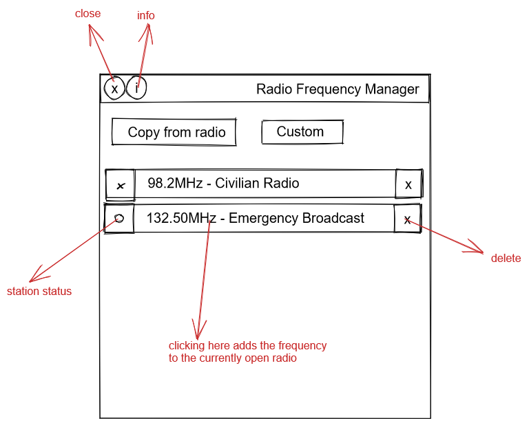

# PZ_RadioFrequencyManager

Adds a simple radio frequency library that enables you to easily store known radio channels and then quickly add them to any other device. Now you can easily listen to the same channels in your home, car , your portable radio or any random device in the world without having to manually add the presets every time.

This mod doesn't automatically discover frequencies or change the way stations work in any way, you still have to find them yourself the first time.

Open the radio's panel and the Radio Frequency Manager at the same time and use the "Copy from radio" button to save the currently selected channel in the radio's dropdown to the RFM.
If you want to add a custom frequency click the Custom button and type the data in the format 'frequency,station name' (for example: 67.2,My Hidden Channel)
. Press the green button to save it, the red X to cancel.

When later you want to **add this station to another device**, or just quickly tune to it if it already exists, click on the frequency name in RFM while the radio's panel is open. The preset will be created in the radio's preset list if it doesn't exist already and then automatically tuned to.

Click on the colored indicators to the left of a frequency's name in RFM to change colors and easily tell them apart. Press the "X" on the right to delete it from RFM.

Concept:

Workshop ID: 2735294987
Mod ID: Kaldo_RadioFrequencyManager
