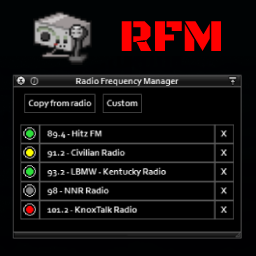
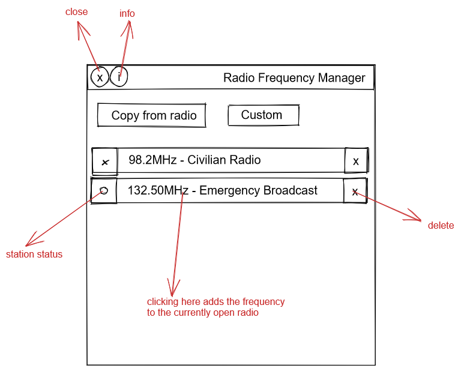

# PZ_RadioFrequencyManager

Adds a new window which makes it possible to copy channels and then apply them afterwards to any other radio. Access it through a new button added on the bottom of radio panels or use the one in the avatar's info panel.

Open the radio's device panel and the Radio Frequency Manager at the same time and use the **"Copy from radio"** button to save the currently selected channel to the RFM.
**Add any custom frequency** by clicking the Custom button and typing 'frequency,station name' (for example: _98.2,My Hidden Channel_)

When later you want to **add this station to another device**, or just quickly tune to it if it already exists, click on the frequency name in RFM. Station will be created in the radio's preset list if missing, and automatically tuned to.

Click on the colored indicators to the left of a frequency's name in RFM to change colors and easily tell them apart. Press the "X" on the right to delete it from RFM.

Concept:

